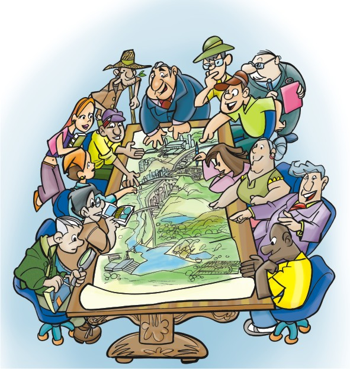

class: middle, center,  title-slide

<!-- inicio font awesome -->
<script src="https://kit.fontawesome.com/1f72d6921a.js" crossorigin="anonymous"></script>
<!-- final font awesome -->

<!-- inicio academic icons -->
<link rel="stylesheet" href="https://cdn.jsdelivr.net/gh/jpswalsh/academicons@1/css/academicons.min.css">

<!-- final academic icons -->


```{r setup, include=FALSE}
options(htmltools.dir.version = FALSE)

knitr::opts_chunk$set(fig.align = "center",
                      message = FALSE,
                      warning = FALSE,
                      echo = FALSE
                      )
```


```{r xaringan-themer, include=FALSE, warning=FALSE}
library(xaringanthemer)
style_duo_accent(
  primary_color = "#2A6F9A",
  secondary_color = "#ECECEC",
  inverse_header_color = "#FFFFFF",
  header_font_google = google_font("Roboto"),
  text_font_google   = google_font("Roboto"),
  code_font_google   = google_font("Roboto Mono")
  ##515151 - cinza
  # #327250 - verde
 )
```


```{r xaringanExtra, echo=FALSE}
#devtools::install_github("gadenbuie/xaringanExtra")
xaringanExtra::use_xaringan_extra(c("tile_view", "animate_css", "tachyons"))

xaringanExtra::use_editable(expires = 1)

xaringanExtra::use_logo(width = "400px",
  image_url = "img/logos_bia.png",
  link_url = "http://pesquisa.ufabc.edu.br/macroamb/"
)

xaringanExtra::use_clipboard()

xaringanExtra::use_fit_screen()

xaringanExtra::use_extra_styles(
  hover_code_line = TRUE,         #<<
  mute_unhighlighted_code = FALSE  #<<
)

xaringanExtra::use_tachyons()

```

```{r metathis, echo=FALSE}
library(metathis)
meta() %>%
  meta_name("github-repo" = "beatrizmilz/IV_ISA_2021") %>%
  meta_social(
    title = "Transparency of Information on the Water Basin Committees Plenums in the Sao Paulo Macrometropolis, Brazil",
    description = paste(
      "Transparency of Information on the Water ",
      "Basin Committees Plenums in the Sao Paulo ",
      "Macrometropolis, Brazil. ",
      "Presented by Beatriz Milz, ",
      "In the conference: IV ISA Forum of Sociology."
      
    ),
    url = "https://macroamb-isaconf2021.netlify.app/",
    image = "https://macroamb-isaconf2021.netlify.app/img/share-card.png",
    image_alt = paste(
      "First slide of the presentation:",
      "Transparency of Information on the Water ",
      "Basin Committees Plenums in the Sao Paulo ",
      "Macrometropolis, Brazil. ",
      "Presented by Beatriz Milz, ",
      "In the conference: IV ISA Forum of Sociology."
    ),
    og_type = "website",
    og_author = "Beatriz Milz",
    twitter_card_type = "summary_large_image",
    twitter_creator = "@beamilz"
  )
```

```{r, out.width="100%"}

```

# Transparency of Information on the Water Basin Committees Plenums in the Sao Paulo Macrometropolis, Brazil


### Beatriz Milz & Pedro Roberto Jacobi

##  FAPESP Grant numbers: 2018/23771-6 e 2015/03804-9

## Presentation available in: [bit.ly/Macroamb](http://bit.ly/Macroamb)


### February 2021

---
class: 


## Authors

.pull-left[

```{r, out.width="150px"}
knitr::include_graphics("img/foto-bia.jpg")
```

__Beatriz Milz__ 

<a href='mailto:beatriz.milz@usp.br'><i class="far fa-envelope"></i></a>  <a href='https://orcid.org/0000-0002-3064-4486'><i class="fab fa-orcid"></i></a>   <a href='http://lattes.cnpq.br/5150665880581477'><i class="ai ai-lattes"></i></a>  <a href='https://beatrizmilz.github.io/resume/resume.pdf'><i class="ai ai-cv"></i></a> <a href='https://twitter.com/BeaMilz'><i class="fab fa-twitter"></i></a>  <a href='https://github.com/beatrizmilz'><i class="fab fa-github"></i></a>


Doctorate Student in Environmental Sciences

Institute of Energy and Environment

University of São Paulo


]


.pull-right[

```{r, out.width="150px"}
knitr::include_graphics("img/foto-pedro.jpg")
```

__Pedro Roberto Jacobi__

<a href='mailto:prjacobi@gmail.com'><i class="far fa-envelope"></i></a>  <a href='https://orcid.org/0000-0001-6143-3019'><i class="fab fa-orcid"></i></a>   <a href='http://lattes.cnpq.br/6799067928413168'><i class="ai ai-lattes"></i></a> <a href='https://twitter.com/prjacobi'><i class="fab fa-twitter"></i></a>

Senior Professor 

Institute of Energy and Environment

University of São Paulo
]


---
class: middle


.bg-washed-blue.b--dark-blue.ba.bw2.br3.shadow-5.ph4.mt5[
Thematic Project from The São Paulo Research Foundation (FAPESP): 

__Environmental governance of macrometropolis paulista in face of climate variability__ (MacroAmb)

.tr[
Grant number:	15/03804-9 
]]

- Read more: [FAPESP](https://bv.fapesp.br/en/auxilios/97000/environmental-governance-of-macrometropolis-paulista-in-face-of-climate-variability/), [Website](http://pesquisa.ufabc.edu.br/macroamb/), [Youtube](https://www.youtube.com/channel/UCXV-E1w76AjukSgWQ7FGkYA/videos).


---

# Sao Paulo Macrometropolis

```{r, out.width="400px"}
knitr::include_graphics("img/mmp-laplan.jpg")
```


???

- The Sao Paulo Macrometropolis (SPMM) is the most important urban agglomeration in Brazil and includes more than 170
municipalities (including the Sao Paulo Metropolitan Region) and more than 33,6 million inhabitants.

- Região de maior influência econômica.

- Mais de 170 municípios (abrangendo a Região Metropolitana de São Paulo)

- Mais de 33 milhões de habitantes (em 2018) ([EMPLASA, 2019](https://emplasa.sp.gov.br/MMP))

- Maior aglomeração urbana do Brasil ([DAEE, 2013](http://www.daee.sp.gov.br/index.php?option=com_content&view=article&id=1112:plano-diretor-de-aproveitamento-dos-recursos-hidricos-para-a-macrometropole-paulista); [TAVARES, 2018](https://scielo.conicyt.cl/scielo.php?script=sci_arttext&pid=S0250-71612018000300115))


---

## 2013 - 2015

### Water Crisis affected the SPMM


```{r, out.width="60%", fig.cap="Fonte: <a href='http://g1.globo.com/sao-paulo/noticia/2014/09/sistema-cantareira-atinge-81-menor-indice-ja-registrado-em-sp.html'> G1, 2014.</a> Descrição: foto da Seca na represa Jaguari-Jacareí."}
knitr::include_graphics("img/g1-seca.jpg")
```


???

- Recently (2014-2015) the SPMM faced a severe water crisis. 

- 2013 - 2015: Crise hídrica afetou a Macrometrópole de São Paulo ([Jacobi; Cibim; Leão, 2015](http://www.scielo.br/scielo.php?script=sci_arttext&pid=S0103-40142015000200027))

<!-- -  Companhia de Saneamento Básico do Estado de São Paulo (SABESP): -->
<!--   - Crise hídrica foi consequência da falta de chuvas -->
<!--   - "A  estiagem  de  2014  foi  um  evento excepcional, sem  precedentes" ([SABESP, 2015, p. 10](http://site.sabesp.com.br/site/uploads/file/crisehidrica/chess_crise_hidrica.pdf)). -->

<!-- - Pesquisadoras(es) apontaram: -->
<!--   - Crise como consequência da falta de gestão estratégica do sistema de abastecimento de água ([Cortês _et al._, 2015](http://www.scielo.br/scielo.php?script=sci_abstract&pid=S0103-40142015000200007&lng=en&nrm=iso&tlng=pt)). -->
  - Falta de transparência de informações sobre a gestão da água ([Empinotti; Jacobi; Fracalanza, 2016](https://www.scielo.br/scielo.php?script=sci_arttext&pid=S0103-40142016000300063))


---
class: middle

<bR>
### Water Resource Management Units


- There are eight Water Resource Management Units (WRMU)
completely or partially in the area of the SPMM:

```{r echo=FALSE}

```

      


  

???

- This region presents complexity of water resources
management, and there are eight Water Resource Management Units (UGRHI) completely or partially in the area of the SPMM. 


- Política Estadual de Recursos Hídricos ([Estado de São Paulo, 1991](https://www.al.sp.gov.br/repositorio/legislacao/lei/1991/lei-7663-30.12.1991.html)):

  - Divide o Estado de São Paulo em 22 Unidades de Gerenciamento de Recursos Hídricos (UGRHI) 
  
  - Oito UGRHIs estão parcial ou completamente na área da Macrometrópole Paulista:
  
      <!-- - Paraíba do Sul -->
      <!-- - Litoral Norte  -->
      <!-- - Piracicaba/Capivari/Jundiaí -->
      <!-- - Alto Tietê -->
      <!-- - Baixada Santista -->
      <!-- - Mogi-Guaçu -->
      <!-- - Tietê/Sorocaba -->
      <!-- - Ribeira de Iguape/Litoral Sul. -->

      
- Cada UGRHI tem o seu correspondente Comitê de Bacia Hidrográfica.
  


    
---
<br>
### Water Basin Committees

```{r echo=FALSE, out.width="50%", fig.cap="Source: Ilustration by <a href='https://www.ana.gov.br/aguas-no-brasil/sistema-de-gerenciamento-de-recursos-hidricos/comites-de-bacia-hidrografica'>Hamilton Rangel</a>."}

```


???


- The National Water Law in Brazil was created in 1997, incorporating modern water resources management principles and creating the “Water basin committees”, which incorporate civil society actors on decision making.

- The transparency of information on water resources management are one of the fundamental conditions for achieving good water governance, along with promoting participation, inclusion, accountability, predictability and responsiveness. 

- Comitês de bacia hidrográfica
  - Grupos de gestão compostos por representantes: ([ANA, 20--](https://www.ana.gov.br/aguas-no-brasil/sistema-de-gerenciamento-de-recursos-hidricos/comites-de-bacia-hidrografica/comite-de-bacia-hidrografica))
      - Poder público estadual, municipal
      - Usuários da água
      - Sociedade civil
      
  - Diversas competências, como: ([BRASIL, 1997](http://www.planalto.gov.br/ccivil_03/Leis/L9433.htm))
      - promover o debate das questões relacionadas a recursos hídricos; 
      - arbitrar os conflitos relacionados aos recursos hídricos;
      - aprovar e acompanhar a execução do Plano de Recursos Hídricos da bacia;
      - entre outros.
      
- Os Comitês se reunem em reuniões para discutir e tomar decisões. 

- As atas de reunião são registros escritos sobre os acontecimentos e assuntos debatidos durante as reuniões dos Comitês.

-  As reuniões dos Comitês de Bacias Hidrográficas devem ser públicas ([Estado de São Paulo, 1991](https://www.al.sp.gov.br/repositorio/legislacao/lei/1991/lei-7663-30.12.1991.html)).

   
---
class: middle

### SigRH

- Portal SigRH - Integrated System
of Water Resources Management of the State of Sao Paulo.

```{r, out.width="90%"}

```
Website: http://www.sigrh.sp.gov.br/

???


- SigRH - Sistema Integrado de Gerenciamento de Recursos Hídricos do Estado de São Paulo

  - Disponibiliza informações sobre a gestão de recursos hídricos no estado de São Paulo publicamente em seu website: http://www.sigrh.sp.gov.br .
  
  - Possui informações das UGRHIs, e seu correspondente Comitê de Bacia.

 
 
---
class: inverse, middle

# Objectives


Considering the importance of the transparency of
information on water resources management:

- We aim to evaluate whether the plenum’s minutes of the Water Basin Committees that are part of the SPMM are made available publicly on the Portal SigRH - Integrated System of Water Resources Management of the State of Sao Paulo.

- Considering the plenum’s minutes encountered, we also aim to identify the most discussed subjects in plenary sessions using text mining methods.


---
# Materials and Methods


-  [R programming language](https://www.r-project.org/) <a href='https://www.r-project.org/'><i class="fab fa-r-project"></i></a>

- Integrated Development Environemnt (IDE):  [RStudio](https://rstudio.com/)
  
```{r, out.width="30%"}
knitr::include_graphics("img/rstudio-r.jpg")
```

- <i class="fas fa-box-open"></i> Several R packages to perform the collection, cleaning, analysis, visualization and communication of the data:  `rvest`, `purrr`, `dplyr`, `tibble`, `stringr`, `magrittr`, `glue`, `ggplot2` (which are part of the `tidyverse`), `httr`, `sf`, `ggspatial`.

---


- The__Data collection__: Web Scraping - December 2020


???
- Discussão baseada nos Princípios de Dados de Governo Aberto (em inglês: _[Principles of Open Government Data](https://opengovdata.io/2014/8-principles/)_ [(TAUBERER, 2014)](https://opengovdata.io/2014/8-principles/) 


---

### Website

```{r, out.width="90%"}
knitr::include_graphics("img/sigrh2.PNG")
```

Website: http://www.sigrh.sp.gov.br/cbhpcj/atas

---
### Website (HTML) -> Web Scraping -> Table 

```{r, out.width="100%"}
knitr::include_graphics("img/carbon_table.png")
```


---
# Preliminary Results 

- Não discriminatório - _Non-Discriminatory_ [(TAUBERER, 2014)](https://opengovdata.io/2014/8-principles/) 

- Dados devem ser completos - _Complete_ [(TAUBERER, 2014)](https://opengovdata.io/2014/8-principles/) 

- Atas disponibilizadas por comitê, ao longo do tempo:

```{r boxplot, echo=FALSE, dpi = 300, out.width="100%", fig.height=3}

# 
# 
# df_ps <- read_rds("../dados/df_preenchida_ughri_2.RDS")
# 
# #teste <-
# df_completo %>%
#   bind_rows(df_ps) %>%
#   left_join(comites, by = c("numero_comite" = "n_ugrhi")) %>%
#   # COMO RETIRAR DUPLICATA, BASEADO NA DATA DA REUNIAo
#   filter(link_ata_ordem == 1) %>%
#   
#   # teste_2 <-
#   #   teste %>%
#   distinct(numero_comite,
#            data_da_reuniao,
#            ugrhi,
#            ano_da_reuniao,
#            .keep_all = TRUE) %>%
#   
#   # anti_join(teste,teste_2) %>% view()
#   
#   group_by(ugrhi, ano_inicio, ano_da_reuniao) %>%
#   
#   count() %>%
#   mutate(
#     ugrhi = case_when(
#       ugrhi == "05 - Piracicaba/Capivari/Jundiaí" ~ "05 - Piracicaba/ \n Capivari/Jundiaí",
#       ugrhi == "11 - Ribeira de Iguape/Litoral Sul" ~ "11 - Ribeira de Iguape \n /Litoral Sul",
#       TRUE ~ ugrhi
#     )
#     
#   ) %>%
#   ggplot() +
#   geom_col(aes(x = ano_da_reuniao, y = n), fill = "#7bc9aa") +
#   
#   geom_vline(aes(xintercept = ano_inicio),
#              color = "red",
#              linetype = 'dashed') +
#   facet_wrap(~ ugrhi, ncol = 4) +
#   theme_bw() +
#   labs(x = "Ano", y = "Número de atas disponibilizadas") +
#   theme(strip.background = element_rect(fill = "#a9d6c4")) +
#   scale_x_continuous(breaks = seq(1990, 2020, 10),
#                      limits = c(1990, 2020)) +
#   theme(text = element_text(size = 8)
#         #,
#         #axis.text.x = element_text(angle=45, hjust=1))
#         


```


```{r include=FALSE}
# library(ggspatial)
# tema_gg <-  theme_bw() +
#   theme(
#     panel.grid.major = element_line(
#       color = gray(0.9),
#       linetype = "dashed",
#       size = 0.1
#     ),
#     panel.background = element_rect(fill = "white")
#   ) +
#   theme(
#     axis.text.y = element_text(
#       angle = 90,
#       hjust = 0.5,
#       size = 8
#     ),
#     axis.text.x = element_text(size = 8),
#     axis.title.y = element_text(size = rel(0.8)),
#     axis.title.x = element_text(size = rel(0.8)),
#     legend.title = element_text(size = rel(0.8))
#   )


```

```{r include=FALSE}
# library(tidyverse)
# library(xtable)
# library(knitr)
# library(sf)
# library(ggrepel)
# 
# sp_ugrhi <-
#   st_read("../submission/dados/DATAGEO/VocacaoUGRHI/VocacaoUGRHIPolygon.shp", options = "ENCODING=WINDOWS-1252") %>% janitor::clean_names()
# 
# mmp_emplasa <-
#   st_read("../submission/dados/DATAGEO/LimiteMacrometropole2015/LimiteMacrometropole2015Polygon.shp", options = "ENCODING=WINDOWS-1252") %>% janitor::clean_names()
# 
# mmp_daee <-
#   st_read("../submission/dados/MMP-DAEE/MMP_Contorno_DAEE.shp", options = "ENCODING=WINDOWS-1252") %>% janitor::clean_names()
# 
# calculo_qnt_reunioes <- df_completo %>%
#   filter(link_ata_ordem == 1) %>%
#   group_by(numero_comite) %>%
#   summarise(n = sum(!is.na(link_ata_url)))
# 
# 
# reunioes_completo <-
#   full_join(sp_ugrhi,
#             calculo_qnt_reunioes,
#             by = c("codigo" = "numero_comite"))  %>% right_join(y = comites, by = c("codigo" = "n_ugrhi")) %>%
#   mutate(n = replace_na(n, 0)) %>%
#   mutate(reunioes_cut = cut(
#     n,
#     breaks = seq(0, max(n) + 30, 30),
#     include.lowest = T
#   ))
```


```{r echo=FALSE, fig.height=5.5, message=FALSE, warning=FALSE, dpi=300, out.width="100%"}
# ggplot() +
#   geom_sf(
#     data = reunioes_completo,
#     aes(geometry = geometry, fill = reunioes_cut),
#     size = 0.5,
#     color = "black"
#   ) +
#   geom_sf(
#     data = sp_ugrhi,
#     aes(),
#     fill = NA,
#     size = 0.5,
#     color = "gray"
#   ) +
#   geom_sf(
#     data = mmp_daee,
#     fill = NA,
#     color = "black",
#     alpha = 0.5
#   ) +
#   coord_sf() +
# 
#   geom_sf_label(data = reunioes_completo, aes(label = codigo), size = 2) +
# 
#   scale_fill_brewer(palette = "RdYlBu", direction = 1) +
# 
# 
#   labs(
#     fill = "Contagem",
#     x = "Longitude",
#     y = "Latitude",
#     caption = "\n UGRHI: 2 - Paraíba do Sul; 3 - Litoral Norte; 5 - Piracicaba/Capivari/Jundiaí; 6 - Alto Tietê; \n 7 - Baixada Santista; 9 - Mogi-Guaçu;  10 - Tietê/Sorocaba; 11 - Ribeira de Iguape/Litoral Sul"
#   ) +
#   tema_gg +
#   annotation_scale(location = "br", width_hint = 0.20) +
# 
#   annotation_north_arrow(
#     location = "br",
#     which_north = "true",
#     height = unit(1, "cm"),
#     width = unit(1, "cm"),
#     pad_x = unit(0.1, "in"),
#     pad_y = unit(0.3, "in"),
#     style = north_arrow_fancy_orienteering
#   ) +
#   theme(
#     legend.position = c(0.11, 0.24),
#     legend.box.background = element_rect(color = "gray", size = 1),
#     legend.box.margin = margin(0, 0, 0, 0)
#   ) +
#   ggsave(
#     "map_count_plenums.jpeg",
#     device = "jpeg",
#     dpi = 600,
#     width = 10
#     ,
#     height = 5
#   ) +
# 
#   theme(plot.caption = element_text(lineheight = 1.5, hjust = 0.5))
```


???
_Non-Discriminatory_ [(TAUBERER, 2014)](https://opengovdata.io/2014/8-principles/): "Data are available to anyone, with no requirement of registration."

_Complete_ [(TAUBERER, 2014)](https://opengovdata.io/2014/8-principles/): "All public data are made available."

---
class: middle

- O link da ata encaminha para uma página web que existe e está funcionando?

  - 200 - Requisição bem sucedida
  - 404 - Não encontrado
  - NA - Não foi disponibilizado link para ata
  
  
.pull-left[


```{r}
# df_comite %>%
#   group_by(ugrhi, link_ata_status) %>%
#   count() %>%
#   ungroup %>%
#   group_by(ugrhi) %>%
#   mutate(soma_total = sum(n, na.rm = TRUE),
#          porc = round(n / soma_total * 100, 1)) %>%
#   select(-n, -soma_total) %>% pivot_wider(names_from = link_ata_status, values_from = porc) %>%
#   mutate(across(everything(), ~ replace_na(.x, 0))) %>%
#   rename("UGRHI" = ugrhi) %>%
#   knitr::kable()
```

]

.pull-right[
```{r echo=FALSE, fig.cap="Fonte da imagem: <a ref='https://sitechecker.pro/'>Site Checker</a>"}
knitr::include_graphics("img/404.png")
```


]


---
class: middle

## Tempo de disponibilidade

- _Timely_ [(TAUBERER, 2014)](https://opengovdata.io/2014/8-principles/) 

- Para atas de reuniões que ocorreram a partir de 2015:

```{r echo=FALSE, dpi = 300, out.width="100%", fig.height=3.5}
# df_comite %>%
#   filter(ano_da_reuniao %in% 2015:2020) %>%
#   filter(tempo_para_postar > 0) %>%
#   mutate(
#     meses_para_postar = tempo_para_postar / 30,
#     ugrhi_reordenado = fct_reorder(nome_ugrhi, tempo_para_postar, .desc = TRUE)
#   ) %>%
#   mutate(type = case_when(numero_comite == 7 ~ "Vermelho",
#                           TRUE ~ "Sem Cor")) %>%
#   
#   ggplot() +
#   
#   geom_boxplot(aes(
#     x = meses_para_postar ,
#     y = ugrhi_reordenado,
#     fill = type,
#     alpha = type
#   )) +
#   theme_bw() +
#   labs(x = "Tempo (em meses) até a postagem da ata", y = "Comitê de Bacia") +
#   scale_fill_manual(values = c("#69b3a2", "red")) +
#   scale_alpha_manual(values = c(1, 0.5)) +
#   theme(legend.position = "none") 
```

???

- _Timely_ [(TAUBERER, 2014)](https://opengovdata.io/2014/8-principles/): Data are made available as quickly as necessary to preserve the value of the data.


---
class: middle

## Extração automatizada dos dados


.pull-left[

<!-- - _Machine Processable_ [(TAUBERER, 2014)](https://opengovdata.io/2014/8-principles/)   -->

- Quais tipos de arquivos são mais disponibilizados?

```{r }
# df_completo %>%
#   #  filter(!is.na(link_ata_tipo_arquivo)) %>%
#   mutate(
#     link_ata_tipo_arquivo_fct = case_when(
#       link_ata_tipo_arquivo %in% c(".doc", ".docx") ~ ".doc | .docx",
#       link_ata_tipo_arquivo %in% c(".html", ".htm") ~ ".html | .htm",
#       link_ata_tipo_arquivo %in% c(".pd", "drive.google") ~ "Outros",
#       is.na(link_ata_tipo_arquivo) ~ "Link não disponibilizado",
#       
#       TRUE ~ link_ata_tipo_arquivo
#     )
#   ) %>%
#   group_by(link_ata_tipo_arquivo_fct) %>%
#   #filter(link_ata_ordem == 1) %>%
#   summarise(count = n())   %>%
#   mutate(total = sum(count),
#          porc = round(count / total, 3)) %>%
#   select(-total) %>%
#   arrange(desc(count)) %>%
#   select(-count) %>%
#   janitor::adorn_pct_formatting() %>%
#   
#   
#   rename("Formato do arquivo" = link_ata_tipo_arquivo_fct,
#          
#          "Porcentagem de links" = porc) %>%
#   knitr::kable()
# 

```
]

.pull-right[

```{r echo=FALSE, out.width="70%", fig.cap='Exemplo de PDF escaneado. Fonte: <a href="http://www.sigrh.sp.gov.br/public/uploads/records//CBH-AT/17494/ata-de-fundacao-e-instalacao-do-cbh-at-doe-18-11-94-caderno-executivo-i-pagina-56.pdf"> SIGRh</a>. '}
knitr::include_graphics("img/pdf-escaneado.jpg")
```

]

???

- _Machine Processable_ [(TAUBERER, 2014)](https://opengovdata.io/2014/8-principles/):  Data are reasonably structured to allow automated processing of it.  


---

# Agradecimentos

As pessoas autoras agradecem o apoio da Fundação de Amparo à Pesquisa do Estado de São Paulo (FAPESP) processo nº __2018/23771-6__. O trabalho é parte das atividades do projeto temático, em andamento, “Governança ambiental na Macrometrópole Paulista, face à variabilidade climática”, processo nº 15/03804-9, financiado pela FAPESP e vinculado ao Programa FAPESP de Pesquisa sobre Mudanças Climáticas Globais.


Agradeço a ajuda:
  - Dúvidas sobre programação: [Bruna Wundervald](https://brunaw.com/), [Daniel Falbel](http://dfalbel.github.io/), [Caio Lente](https://lente.dev/), [José de Jesus Filho](https://github.com/jjesusfilho), [Athos Damiani](https://github.com/Athospd).

  - Sugestões com a apresentação: [Igor Matheus Santana Chaves](https://orcid.org/0000-0003-3833-9301), [Lidiane Alonso Paixão dos Anjos](https://orcid.org/0000-0001-8054-0987), [Julio Trecenti](https://github.com/jtrecenti), [Angélica Custódio](https://www.linkedin.com/in/angelicacustodio/?originalSubdomain=br)


Amauri Polacchi
---
class: bib
# Referências


BRASIL. 1997. “LEI nº 9.433, DE 8 DE JANEIRO DE 1997.” http://www.planalto.gov.br/ccivil_03/Leis/L9433.htm

DAEE. 2013. “Macrometrópole - Sumário Executivo - Plano Diretor de Aproveitamento de Recursos Hídricos Para a Macrometrópole Paulista.” http://www.daee.sp.gov.br/index.php?option=com_content&view=article&id=1112:plano-diretor-de-aproveitamento-dos-recursos-hidricos-para-a-macrometropole-paulista.

EMPLASA. 2017. “Macrometrópole Paulista”. https://www.emplasa.sp.gov.br/MMP.

R Core Team. 2019. R: A Language and Environment for Statistical Computing. Vienna, Austria: R Foundation for Statistical Computing. https://www.R-project.org/.

Sao Paulo State. 2020. “Portal SIGRH - Sistema Integrado de Gerenciamento de Recursos Hídricos Do Estado de São Paulo.” http://www.sigrh.sp.gov.br/.

———. 1991. “Lei Nº 7.663, de 30 de Dezembro de 1991.” http://www.al.sp.gov.br/leis/legislacao-doestado/.

Tauberer, Joshua. 2014. Open Government Data: The Book. 2nd ed. https://opengovdata.io/2014/8-principles/.

Wickham, Hadley, Mara Averick, Jennifer Bryan, Winston Chang, Lucy D’Agostino McGowan, Romain François, Garrett Grolemund, et al. 2019. “Welcome to the tidyverse.” Journal of Open Source Software 4 (43): 1686. https://doi.org/10.21105/joss.01686.


---
class: center, middle

## Thank you!


<center>

Find us at: <BR><br></center>


- Beatriz Milz:

  <a href='mailto:beatriz.milz@usp.br'><i class="far fa-envelope"></i> beatriz.milz@usp.br</a> / <a href='https://twitter.com/BeaMilz'><i class="fab fa-twitter"></i> @BeaMilz</a> / <a href='https://github.com/beatrizmilz'><i class="fab fa-github"></i> beatrizmilz</a> 


- Pedro Jacobi:

  <a href='mailto:prjacobi@gmail.com'><i class="far fa-envelope"></i> prjacobi@gmail.com</a> <br><br>


Presentation made with <a href='https://www.r-project.org/'><i class="fab fa-r-project"></i></a> and the packages <i class="fas fa-box-open"></i> [**xaringan**](https://github.com/yihui/xaringan) and <i class="fas fa-box-open"></i> [**xaringanthemer**](https://pkg.garrickadenbuie.com/xaringanthemer/).

