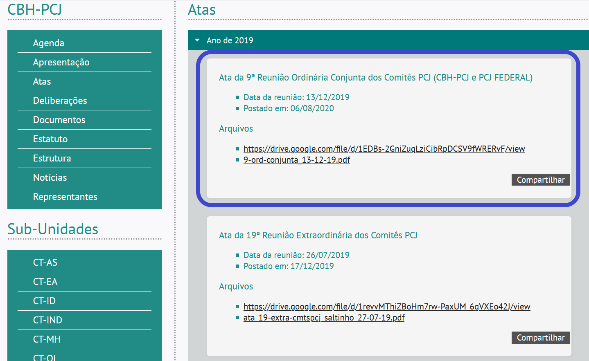
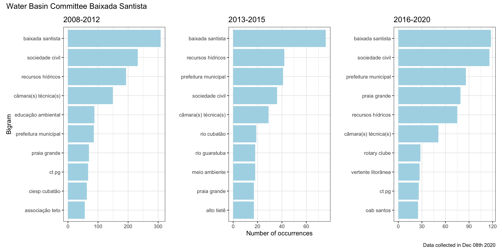

class: middle, center,  title-slide

<!-- inicio font awesome -->
<script src="https://kit.fontawesome.com/1f72d6921a.js" crossorigin="anonymous"></script>
<!-- final font awesome -->

<!-- inicio academic icons -->
<link rel="stylesheet" href="https://cdn.jsdelivr.net/gh/jpswalsh/academicons@1/css/academicons.min.css">

<!-- final academic icons -->


```{r setup, include=FALSE}
options(htmltools.dir.version = FALSE)

knitr::opts_chunk$set(fig.align = "center",
                      message = FALSE,
                      warning = FALSE,
                      echo = FALSE
                      )

library(tidyverse)
```


```{r xaringan-themer, include=FALSE, warning=FALSE}
library(xaringanthemer)
style_duo_accent(
  primary_color = "#2A6F9A",
  secondary_color = "#ECECEC",
  inverse_header_color = "#FFFFFF",
  header_font_google = google_font("Roboto"),
  text_font_google   = google_font("Roboto"),
  code_font_google   = google_font("Roboto Mono")
  ##515151 - cinza
  # #327250 - verde
 )
```


```{r xaringanExtra, echo=FALSE}
#devtools::install_github("gadenbuie/xaringanExtra")
xaringanExtra::use_xaringan_extra(c("tile_view", "animate_css", "tachyons"))

xaringanExtra::use_editable(expires = 1)

xaringanExtra::use_logo(width = "400px",
  image_url = "img/logos_bia.png",
  link_url = "http://pesquisa.ufabc.edu.br/macroamb/",
    
)

xaringanExtra::use_clipboard()

xaringanExtra::use_fit_screen()

xaringanExtra::use_extra_styles(
  hover_code_line = TRUE,         #<<
  mute_unhighlighted_code = FALSE  #<<
)

xaringanExtra::use_tachyons()

```

```{r xaringan-panelset, echo=FALSE}
xaringanExtra::use_panelset()
```


```{r metathis, echo=FALSE}
library(metathis)
meta() %>%
  meta_name("github-repo" = "beatrizmilz/IV_ISA_2021") %>%
  meta_social(
    title = "Transparency of Information on the Water Basin Committees Plenums in the Sao Paulo Macrometropolis, Brazil",
    description = paste(
      "Transparency of Information on the Water ",
      "Basin Committees Plenums in the Sao Paulo ",
      "Macrometropolis, Brazil. ",
      "Presented by Beatriz Milz, ",
      "In the conference: IV ISA Forum of Sociology."
      
    ),
    url = "https://macroamb-isaconf2021.netlify.app/",
    image = "https://macroamb-isaconf2021.netlify.app/img/share-card.png",
    image_alt = paste(
      "First slide of the presentation:",
      "Transparency of Information on the Water ",
      "Basin Committees Plenums in the Sao Paulo ",
      "Macrometropolis, Brazil. ",
      "Presented by Beatriz Milz, ",
      "In the conference: IV ISA Forum of Sociology."
    ),
    og_type = "website",
    og_author = "Beatriz Milz",
    twitter_card_type = "summary_large_image",
    twitter_creator = "@beamilz"
  )
```

```{r, out.width="100%"}
knitr::include_graphics("img/isaconf.png")
```

# Transparency of Information on the Water Basin Committees Plenums in the Sao Paulo Macrometropolis, Brazil


### Beatriz Milz & Pedro Roberto Jacobi

##  FAPESP Grant numbers: 2018/23771-6 e 2015/03804-9

## Presentation available in: [bit.ly/Macroamb](http://bit.ly/Macroamb)


### February 2021

---
class: 


## Authors

.pull-left[

```{r, out.width="150px"}
knitr::include_graphics("img/foto-bia.jpg")
```

__Beatriz Milz__ 

<a href='mailto:beatriz.milz@usp.br'><i class="far fa-envelope"></i></a>  <a href='https://orcid.org/0000-0002-3064-4486'><i class="fab fa-orcid"></i></a>   <a href='http://lattes.cnpq.br/5150665880581477'><i class="ai ai-lattes"></i></a>  <a href='https://beatrizmilz.github.io/resume/resume.pdf'><i class="ai ai-cv"></i></a> <a href='https://twitter.com/BeaMilz'><i class="fab fa-twitter"></i></a>  <a href='https://github.com/beatrizmilz'><i class="fab fa-github"></i></a>


Doctorate Student in Environmental Sciences

Institute of Energy and Environment

University of São Paulo


]


.pull-right[

```{r, out.width="150px"}

```

__Pedro Roberto Jacobi__

<a href='mailto:prjacobi@gmail.com'><i class="far fa-envelope"></i></a>  <a href='https://orcid.org/0000-0001-6143-3019'><i class="fab fa-orcid"></i></a>   <a href='http://lattes.cnpq.br/6799067928413168'><i class="ai ai-lattes"></i></a> <a href='https://twitter.com/prjacobi'><i class="fab fa-twitter"></i></a>

Senior Professor 

Institute of Energy and Environment

University of São Paulo
]


---
class: middle


.bg-washed-blue.b--dark-blue.ba.bw2.br3.shadow-5.ph4.mt5[
Thematic Project from The São Paulo Research Foundation (FAPESP): 

__Environmental governance of macrometropolis paulista in face of climate variability__ (MacroAmb)

.tr[
Grant number:	15/03804-9 
]]

- Read more: [FAPESP](https://bv.fapesp.br/en/auxilios/97000/environmental-governance-of-macrometropolis-paulista-in-face-of-climate-variability/), [Website](http://pesquisa.ufabc.edu.br/macroamb/), [Youtube](https://www.youtube.com/channel/UCXV-E1w76AjukSgWQ7FGkYA/videos).


---

# Sao Paulo Macrometropolis

```{r, out.width="400px"}

```


???

- The Sao Paulo Macrometropolis (SPMM) is the most important urban agglomeration in Brazil and includes more than 170
municipalities (including the Sao Paulo Metropolitan Region) and more than 33,6 million inhabitants.

- Região de maior influência econômica.

- Mais de 170 municípios (abrangendo a Região Metropolitana de São Paulo)

- Mais de 33 milhões de habitantes (em 2018) ([EMPLASA, 2019](https://emplasa.sp.gov.br/MMP))

- Maior aglomeração urbana do Brasil ([DAEE, 2013](http://www.daee.sp.gov.br/index.php?option=com_content&view=article&id=1112:plano-diretor-de-aproveitamento-dos-recursos-hidricos-para-a-macrometropole-paulista); [TAVARES, 2018](https://scielo.conicyt.cl/scielo.php?script=sci_arttext&pid=S0250-71612018000300115))


---

## 2013 - 2015

### Water Crisis affected the SPMM


```{r, out.width="60%", fig.cap="Source: <a href='http://g1.globo.com/sao-paulo/noticia/2014/09/sistema-cantareira-atinge-81-menor-indice-ja-registrado-em-sp.html'> G1, 2014.</a> Description: Photo of the drought in the reservouir Jaguari-Jacareí."}
knitr::include_graphics("img/g1-seca.jpg")
```


???

- Recently (2014-2015) the SPMM faced a severe water crisis. 

- 2013 - 2015: Crise hídrica afetou a Macrometrópole de São Paulo ([Jacobi; Cibim; Leão, 2015](http://www.scielo.br/scielo.php?script=sci_arttext&pid=S0103-40142015000200027))

<!-- -  Companhia de Saneamento Básico do Estado de São Paulo (SABESP): -->
<!--   - Crise hídrica foi consequência da falta de chuvas -->
<!--   - "A  estiagem  de  2014  foi  um  evento excepcional, sem  precedentes" ([SABESP, 2015, p. 10](http://site.sabesp.com.br/site/uploads/file/crisehidrica/chess_crise_hidrica.pdf)). -->

<!-- - Pesquisadoras(es) apontaram: -->
<!--   - Crise como consequência da falta de gestão estratégica do sistema de abastecimento de água ([Cortês _et al._, 2015](http://www.scielo.br/scielo.php?script=sci_abstract&pid=S0103-40142015000200007&lng=en&nrm=iso&tlng=pt)). -->
  - Falta de transparência de informações sobre a gestão da água ([Empinotti; Jacobi; Fracalanza, 2016](https://www.scielo.br/scielo.php?script=sci_arttext&pid=S0103-40142016000300063))


---
class: middle

<bR>
### Water Resource Management Units


- There are eight Water Resource Management Units (WRMU)
completely or partially in the area of the SPMM:

```{r echo=FALSE}
knitr::include_graphics("img/map_ugrhi.jpeg")
```

      


  

???

- This region presents complexity of water resources
management, and there are eight Water Resource Management Units (UGRHI) completely or partially in the area of the SPMM. 


- Política Estadual de Recursos Hídricos ([Estado de São Paulo, 1991](https://www.al.sp.gov.br/repositorio/legislacao/lei/1991/lei-7663-30.12.1991.html)):

  - Divide o Estado de São Paulo em 22 Unidades de Gerenciamento de Recursos Hídricos (UGRHI) 
  
  - Oito UGRHIs estão parcial ou completamente na área da Macrometrópole Paulista:
  
      <!-- - Paraíba do Sul -->
      <!-- - Litoral Norte  -->
      <!-- - Piracicaba/Capivari/Jundiaí -->
      <!-- - Alto Tietê -->
      <!-- - Baixada Santista -->
      <!-- - Mogi-Guaçu -->
      <!-- - Tietê/Sorocaba -->
      <!-- - Ribeira de Iguape/Litoral Sul. -->

      
- Cada UGRHI tem o seu correspondente Comitê de Bacia Hidrográfica.
  


    
---
<br>
### Water Basin Committees

```{r echo=FALSE, out.width="50%", fig.cap="Source: Ilustration by <a href='https://www.ana.gov.br/aguas-no-brasil/sistema-de-gerenciamento-de-recursos-hidricos/comites-de-bacia-hidrografica'>Hamilton Rangel</a>."}
knitr::include_graphics("img/comite2.jpg")
```


???


- The National Water Law in Brazil was created in 1997, incorporating modern water resources management principles and creating the “Water basin committees”, which incorporate civil society actors on decision making.

- The transparency of information on water resources management are one of the fundamental conditions for achieving good water governance, along with promoting participation, inclusion, accountability, predictability and responsiveness. 

- Comitês de bacia hidrográfica
  - Grupos de gestão compostos por representantes: ([ANA, 20--](https://www.ana.gov.br/aguas-no-brasil/sistema-de-gerenciamento-de-recursos-hidricos/comites-de-bacia-hidrografica/comite-de-bacia-hidrografica))
      - Poder público estadual, municipal
      - Usuários da água
      - Sociedade civil
      
  - Diversas competências, como: ([BRASIL, 1997](http://www.planalto.gov.br/ccivil_03/Leis/L9433.htm))
      - promover o debate das questões relacionadas a recursos hídricos; 
      - arbitrar os conflitos relacionados aos recursos hídricos;
      - aprovar e acompanhar a execução do Plano de Recursos Hídricos da bacia;
      - entre outros.
      
- Os Comitês se reunem em reuniões para discutir e tomar decisões. 

- As atas de reunião são registros escritos sobre os acontecimentos e assuntos debatidos durante as reuniões dos Comitês.

-  As reuniões dos Comitês de Bacias Hidrográficas devem ser públicas ([Estado de São Paulo, 1991](https://www.al.sp.gov.br/repositorio/legislacao/lei/1991/lei-7663-30.12.1991.html)).

   
---
class: middle

### SigRH

- Portal SigRH - Integrated System
of Water Resources Management of the State of Sao Paulo.

```{r, out.width="90%"}
knitr::include_graphics("img/sigrh.PNG")
```
Website: http://www.sigrh.sp.gov.br/

???


- SigRH - Sistema Integrado de Gerenciamento de Recursos Hídricos do Estado de São Paulo

  - Disponibiliza informações sobre a gestão de recursos hídricos no estado de São Paulo publicamente em seu website: http://www.sigrh.sp.gov.br .
  
  - Possui informações das UGRHIs, e seu correspondente Comitê de Bacia.

 
 
---
class: inverse, middle

# Objectives


Considering the importance of the transparency of
information on water resources management:

1) We aim to evaluate whether the plenum’s minutes of the Water Basin Committees that are part of the SPMM are made available publicly on the Portal SigRH - Integrated System of Water Resources Management of the State of Sao Paulo.

2) Considering the plenum’s minutes encountered, we also aim to identify the most discussed subjects in plenary sessions using text mining methods.


---
class: hide_logo

# Materials and Methods


-  [R programming language](https://www.r-project.org/) <a href='https://www.r-project.org/'><i class="fab fa-r-project"></i></a>

- Integrated Development Environemnt (IDE):  [RStudio](https://rstudio.com/)
  
```{r, out.width="30%"}

```

- <i class="fas fa-box-open"></i> Several R packages to perform the collection, cleaning, analysis, visualization and communication of the data:  `rvest`, `purrr`, `dplyr`, `tibble`, `stringr`, `magrittr`, `glue`, `ggplot2` , `tidyr`, `readr` (which are part of the `tidyverse`), `httr`, `sf`, `ggspatial`, `patchwork`, `tidytext`, `readtext`, `xml2`, `rvest`.

---
class: hide_logo

# Materials and Methods

- An R package is being developed: [ComitesBaciaSP](https://beatrizmilz.github.io/ComitesBaciaSP/).

- Functions are already available to scrape data from plenums minutes and list of participants in the WBC.


---

### Website

```{r, out.width="90%"}

```

Website: http://www.sigrh.sp.gov.br/cbhpcj/atas

---
class: hide_logo
### Website (HTML) -> Web Scraping -> Table 

```{r, out.width="100%"}

```


---
class: hide_logo

# Materials and Methods

## Objetive 1:

1) __Data collection__: Web Scraping using package [`ComitesBaciaSP`](https://beatrizmilz.github.io/ComitesBaciaSP/) - December 8th 2020.

2) Downloaded the html pages in order to have a backup. 

3) Every file in the dataset (total of 930) was tested in order to see if the file was available.


---
class: hide_logo

# Materials and Methods

## Objetive 2:

4) Downloaded all the files available for the plenums minutes.

5) Filtered the dataset in order to have 1 file of minute per plenum. Examples: 

  - There were plenums that had duplicate files for minutes. Removed the duplicates.
  
  - There were files with wrong date of the plenum in the website. Checked and corrected in the dataset.
  
  - There were minutes available as images. 

---
class: hide_logo

# Materials and Methods

## Objetive 2:

6) Read the files for the minutes in the resulted dataset (656 files), into a new dataset with a column with the content of the minute, and also an id for each plenum. 
 
  - Some word files had problems, and were converted to PDF outside R in order to be able to import the content.

7) Data was categorized: before (2008 - 2012), during  (2013 - 2015) and after the water crisis (2016 - 2020).

8) Using text mining methods ([SILGE & ROBINSON, 2017](https://www.tidytextmining.com/)), constructed vizualizations of the frequency of bigrams in this 3 periods for each WBC.

 
```{r}
#dataset_corpus_raw <- readr::read_rds("../data/dataset_corpus_raw.Rds")

# dataset_corpus_raw %>% nrow()
# dataset_corpus_raw %>% head() %>% select(1:2) %>% DT::datatable()

```


---
class: hide_logo
# Preliminary Results 


- _Non-Discriminatory_ [(TAUBERER, 2014)](https://opengovdata.io/2014/8-principles/): "Data are available to anyone, with no requirement of registration."

- _Complete_ [(TAUBERER, 2014)](https://opengovdata.io/2014/8-principles/): "All public data are made available."
   - Paraíba do Sul: this WBC did not made any plenums minutes available (as in 08-12-2020).
   - Sorocaba e Médio Tietê: there are period gaps.
   - The marjority of the links to the plenums minutes available was working.

---
class: hide_logo, middle

# Preliminary Results 


.panelset[
.panel[.panel-name[AT]

```{r}

```
]

.panel[.panel-name[BS]

```{r}

```
]


.panel[.panel-name[LN]

```{r}

```
]


.panel[.panel-name[Mogi]

```{r}

```
]


.panel[.panel-name[PCJ]

```{r}

```
]


.panel[.panel-name[PS]


.bg-washed-red.b--dark-red.ba.bw2.br3.shadow-5.ph4.mt5[

Water Basin Committee Paraíba do Sul

__NOTHING AVAILABLE__

.tr[
Data collected in Dec 08th 2020
]]
<br> 
<br>
<br> 
<br>


]


.panel[.panel-name[RB]

```{r}

```
]


.panel[.panel-name[SMT]

```{r}

```
]


]

---
class: hide_logo

# Preliminary conclusions

- Climate change was not in any of the visualizations of the most frequent bigrams

- Data from the plemuns minutes need to be more complete:
  - Data are not available for Paraíba do Sul
  - There is no data for Sorocaba and Médio Tietê during the water crisis
  
- ...


---
class: hide_logo
# Acknowledgments

This research is contemplated by the FAPESP postgraduate scholarship nº 2018/23771-6, and FAPESP Thematic Project  nº 2015/03804-9. 


We also thank for the help:  [Amauri Polacchi](http://buscatextual.cnpq.br/buscatextual/visualizacv.do?id=K8273692Y0), [Angélica Custódio](https://www.linkedin.com/in/angelicacustodio/?originalSubdomain=br), [Athos Damiani](https://github.com/Athospd), [Bruna Wundervald](https://brunaw.com/), [Caio Lente](https://lente.dev/), [Daniel Falbel](http://dfalbel.github.io/), [Igor Matheus Santana Chaves](https://orcid.org/0000-0003-3833-9301), [José de Jesus Filho](https://github.com/jjesusfilho),  [Lidiane Alonso Paixão dos Anjos](https://orcid.org/0000-0001-8054-0987), [Julio Trecenti](https://github.com/jtrecenti).

---
class: bib
# References


BRASIL. 1997. “LEI nº 9.433, DE 8 DE JANEIRO DE 1997.” http://www.planalto.gov.br/ccivil_03/Leis/L9433.htm

DAEE. 2013. “Macrometrópole - Sumário Executivo - Plano Diretor de Aproveitamento de Recursos Hídricos Para a Macrometrópole Paulista.” http://www.daee.sp.gov.br/index.php?option=com_content&view=article&id=1112:plano-diretor-de-aproveitamento-dos-recursos-hidricos-para-a-macrometropole-paulista.

EMPLASA. 2017. “Macrometrópole Paulista”. https://www.emplasa.sp.gov.br/MMP.

R Core Team. 2019. R: A Language and Environment for Statistical Computing. Vienna, Austria: R Foundation for Statistical Computing. https://www.R-project.org/.

Sao Paulo State. 2020. “Portal SIGRH - Sistema Integrado de Gerenciamento de Recursos Hídricos Do Estado de São Paulo.” http://www.sigrh.sp.gov.br/.

<!-- ———. 1991. “Lei Nº 7.663, de 30 de Dezembro de 1991.” http://www.al.sp.gov.br/leis/legislacao-doestado/. -->


Silge, Julia. Robinson, David.   Text Mining with R. 1. ed. O’Reilly, 2017.  https://www.tidytextmining.com/

Tauberer, Joshua. 2014. Open Government Data: The Book. 2nd ed. https://opengovdata.io/2014/8-principles/.

Wickham, Hadley, Mara Averick, Jennifer Bryan, Winston Chang, Lucy D’Agostino McGowan, Romain François, Garrett Grolemund, et al. 2019. “Welcome to the tidyverse.” Journal of Open Source Software 4 (43): 1686. https://doi.org/10.21105/joss.01686.


---
class: center, middle

## Thank you!


<center>

Find us at: <BR><br></center>


- Beatriz Milz:

  <a href='mailto:beatriz.milz@usp.br'><i class="far fa-envelope"></i> beatriz.milz@usp.br</a> / <a href='https://twitter.com/BeaMilz'><i class="fab fa-twitter"></i> @BeaMilz</a> / <a href='https://github.com/beatrizmilz'><i class="fab fa-github"></i> beatrizmilz</a> 


- Pedro Jacobi:

  <a href='mailto:prjacobi@gmail.com'><i class="far fa-envelope"></i> prjacobi@gmail.com</a> <br><br>


Presentation made with <a href='https://www.r-project.org/'><i class="fab fa-r-project"></i></a> and the packages <i class="fas fa-box-open"></i> [**xaringan**](https://github.com/yihui/xaringan) and <i class="fas fa-box-open"></i> [**xaringanthemer**](https://pkg.garrickadenbuie.com/xaringanthemer/).

